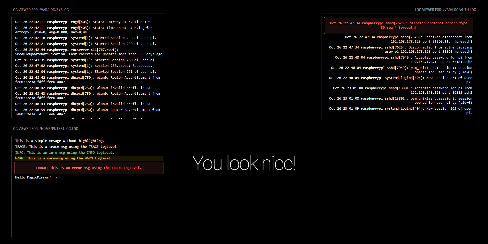

# MMM-LogfileViewer

A [MagicMirror²](https://github.com/MagicMirrorOrg/MagicMirror) module that displays real-time log file content with `tail -f` functionality. Monitor your system logs, application logs, or any text file with live updates and beautiful log-level color coding.

## ✨ Features

- 📁 **Real-time Log Monitoring**: Watch log files for changes and display updates instantly with `tail -f` behavior
- 🎨 **Log Level Color Coding**: Automatic color coding for ERROR, WARN, INFO, and DEBUG levels
- 🔧 **Flexible Styling**: Support for any CSS property through configuration
- 📏 **Configurable Font Sizes**: Predefined sizes (small/medium/large) or custom CSS values like `"16px"`, `"1.2em"`
- ⚡ **Performance Optimized**: Uses chokidar with optimal settings for efficient file watching
- 🌐 **Cross-Platform**: Works seamlessly on Windows, macOS, and Linux


## Screenshot



## 🚀 Installation

1. Navigate to your MagicMirror's modules directory:
```bash
cd ~/MagicMirror/modules
```

2. Clone this repository:
```bash
git clone https://github.com/schlomm/MMM-LogfileViewer.git
```

3. Install dependencies:
```bash
cd MMM-LogfileViewer
npm install
```

## ⚙️ Configuration

Add the module to your `config/config.js` file:

```javascript
{
    module: "MMM-LogfileViewer",
    position: "bottom_left", // Choose your preferred position
    config: {
        filePath: "/var/log/syslog",  // Required: path to your log file
        showTitle: true,              // Optional: show title header
        titlePrefix: "System Log: ",  // Optional: title prefix
        showFullPath: false,          // Optional: show only filename in title
        height: "400px",              // Optional: height of the log viewer
        width: "600px",               // Optional: width of the log viewer
        numberOfLines: 15,            // Optional: number of lines to display
        fontSize: "14px",             // Optional: font size
        updateInterval: 1000,         // Optional: update interval in ms
        logLevels: {                  // Optional: customize log level colors
            ERROR: { color: "#ff6b6b", fontWeight: "bold" },
            WARN: { color: "#ffd93d", backgroundColor: "rgba(255,217,61,0.1)" },
            INFO: { color: "#6bcf7f" },
            DEBUG: { color: "#888", fontStyle: "italic" }
        },
        customStyles: {               // Optional: additional CSS styling
            container: { 
                padding: "10px", 
                border: "1px solid #333",
                borderRadius: "5px",
                backgroundColor: "rgba(0,0,0,0.3)"
            },
            logLine: { 
                fontFamily: "monospace",
                lineHeight: "1.2"
            }
        }
    }
}
```

## 📋 Configuration Options

| Option | Type | Default | Description |
|--------|------|---------|-------------|
| `filePath` | `string` | `""` | **Required.** Path to the log file to monitor |
| `showTitle` | `boolean` | `true` | Show the module header with title. If `false`, no header is displayed |
| `titlePrefix` | `string` | `"Log Viewer for: "` | Prefix text shown before the file path/name in the module header |
| `showFullPath` | `boolean` | `true` | Show full file path in title. If `false`, shows only filename |
| `height` | `string` | `"300px"` | Height of the log viewer container (any CSS value: px, em, %, vh, etc.) |
| `width` | `string` | `"300px"` | Width of the log viewer container (any CSS value: px, em, %, vw, etc.) |
| `numberOfLines` | `number` | `10` | Number of lines to display from the end of the file |
| `fontSize` | `string` | `"medium"` | Font size: `"small"`, `"medium"`, `"large"`, or any CSS value like `"16px"`, `"1.2em"` |
| `updateInterval` | `number` | `1000` | File polling interval in milliseconds |
| `logLevels` | `object` | See below | Color and style configuration for different log levels |
| `customStyles` | `object` | `{}` | Additional CSS styles for any element |

### Default Log Level Configuration

```javascript
logLevels: {
    ERROR: { color: "#ff6b6b", fontWeight: "bold" },
    WARN: { color: "#ffd93d", backgroundColor: "#333" },
    INFO: { color: "#6bcf7f" },
    DEBUG: { color: "#888", fontStyle: "italic" }
}
```

### Custom Styles

You can apply any CSS property to different elements:

```javascript
customStyles: {
    container: {
        padding: "15px",
        border: "2px solid #555",
        borderRadius: "10px",
        backgroundColor: "rgba(0,0,0,0.5)",
        maxHeight: "400px",
        overflowY: "auto"
    },
    errorMessage: {
        color: "#ff0000",
        textAlign: "center",
        fontSize: "18px"
    },
    logLine: {
        fontFamily: "'Courier New', monospace",
        lineHeight: "1.5",
        padding: "3px 6px",
        margin: "2px 0"
    }
}
```

## 💡 Usage Examples

### Basic System Log Monitoring
```javascript
config: {
    filePath: "/var/log/syslog",
    titlePrefix: "System: ",
    showFullPath: false,  // Shows only "System: syslog"
    numberOfLines: 20,
    fontSize: "small"
}
```

### Application Log with Custom Styling
```javascript
config: {
    filePath: "/var/log/myapp/app.log",
    titlePrefix: "MyApp: ",
    showFullPath: true,   // Shows "MyApp: /var/log/myapp/app.log"
    height: "500px",
    width: "800px",
    numberOfLines: 25,
    fontSize: "16px",
    logLevels: {
        ERROR: { color: "#ff4444", fontWeight: "bold", backgroundColor: "rgba(255,68,68,0.2)" },
        WARN: { color: "#ffaa00", fontWeight: "600" },
        INFO: { color: "#00ff88" },
        DEBUG: { color: "#666", opacity: "0.7" }
    },
    customStyles: {
        container: {
            backgroundColor: "rgba(0,0,0,0.8)",
            border: "1px solid #333",
            borderRadius: "8px",
            padding: "12px"
        }
    }
}
```

## 🏗️ Architecture

### File Structure
- `MMM-LogfileViewer.js` - Main module file with MagicMirror² lifecycle methods
- `node_helper.js` - Backend Node.js helper for efficient file system operations  
- `MMM-LogfileViewer.css` - Styling with log-level color coding and responsive design
- `package.json` - Dependencies and module metadata


### Supported Log Formats

The module automatically detects log levels in various formats:
- `ERROR`, `WARN`/`WARNING`, `INFO`, `DEBUG` (case-insensitive)
- Works with most standard log formats (syslog, application logs, etc.)

## 🐛 Troubleshooting

### Common Issues

1. **File not found**
   - Verify the file path is correct and the file exists
   - Check: `ls -la /path/to/your/logfile`

2. **Permission denied**
   - Ensure MagicMirror has read access to the log file
   - Fix: `sudo chmod +r /path/to/your/logfile`

3. **File deleted during monitoring**
   - Module will display error when watched file is removed
   - Restart module after file is recreated

4. **Performance issues with very active logs**
   - Increase `updateInterval` to reduce CPU usage
   - Decrease `numberOfLines` to display fewer lines
   - Monitor system resources

### Debug Mode

Enable debug logging by setting log level in MagicMirror config:

```javascript
logLevel: ["INFO", "LOG", "WARN", "ERROR", "DEBUG"]
```

## 📄 License

MIT License - see [LICENSE](LICENSE) file for details.

## ❓ Support & Feature Requests

If you have questions, encounter issues, or would like to request new features, please create a GitHub issue:

🐛 **Bug Reports**: [Create an Issue](https://github.com/schlomm/MMM-LogfileViewer/issues/new)
- Include your MagicMirror version
- Provide your module configuration (remove sensitive data)
- Share relevant log output from browser console

💡 **Feature Requests**: [Create an Issue](https://github.com/schlomm/MMM-LogfileViewer/issues/new)
- Describe the feature and its use case
- Explain how it would improve the module
- Consider compatibility with existing functionality

❓ **Questions**: [Browse Existing Issues](https://github.com/schlomm/MMM-LogfileViewer/issues) or create a new one

## 🤝 Contributing

1. Fork the repository
2. Create a feature branch
3. Make your changes with proper testing
4. Submit a pull request

## 📋 Changelog

### Version 1.0.0 (Current)
- Initial release with real-time log file monitoring
- Log level color coding with full CSS support
- Optimal chokidar file watching implementation
- Comprehensive error handling and user feedback
- Cross-platform compatibility
- Flexible styling system with custom CSS support

## 🙏 Acknowledgments

- [MagicMirror²](https://github.com/MagicMirrorOrg/MagicMirror) - The amazing smart mirror platform
- [chokidar](https://github.com/paulmillr/chokidar) - Efficient file watching library